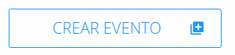
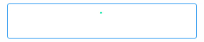
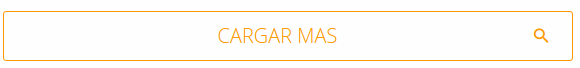
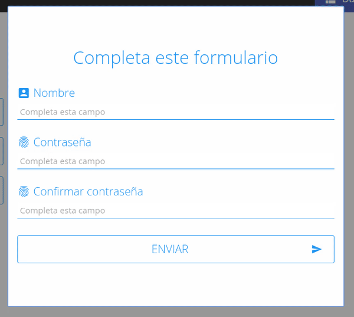
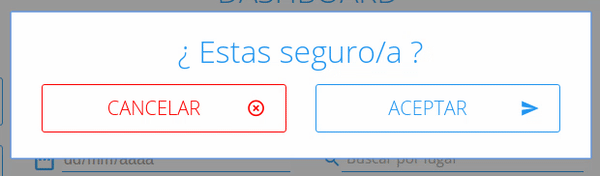
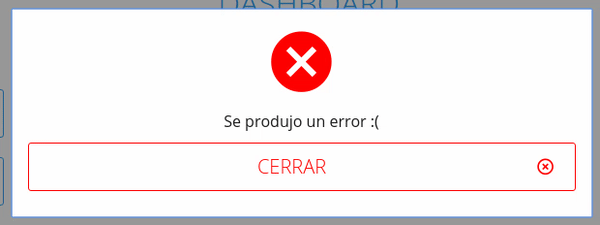
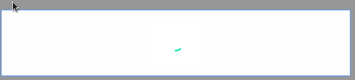
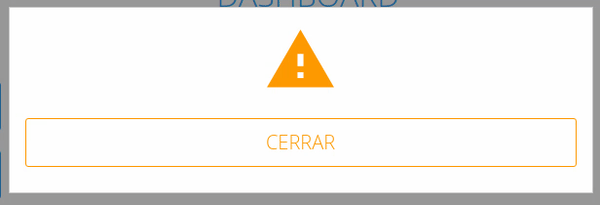
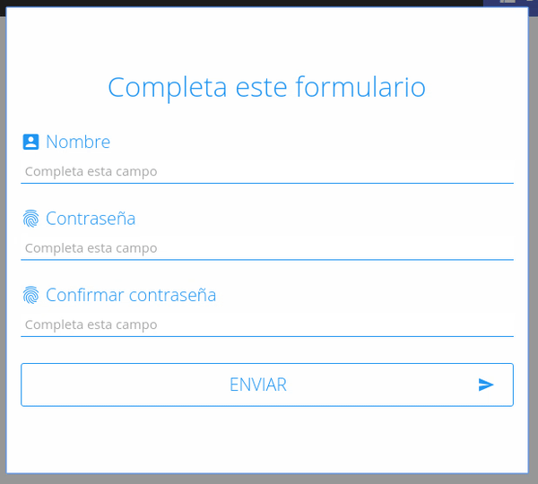

## Componentes ##

 - Gestor de tareas
 - Arquitectura de carpetas y componentes
 - Componentes

Gestor de tareas
-------
El gestor de tareas tiene como objetivo principal completar 2 tareas las cuales son:

 1. Transpilar el codigo es2015 a ECMAScript 5.1 y a su vez a [React](https://facebook.github.io/react/)
 2. Transpilar el codigo sass a codigo css utlizando el framework [Foundation css](http://foundation.zurb.com/)

Arquitectura de carpetas
-------
Para el frontend la arquitectura de carpetas consiste en 2 carpetas principales y un archivos los cuales son **js**  y **scss** las cuales estan representadas por este árbol de archivos:

 - src
   - **scss**
     - **components**
       - componente.scss
     -  app.scss

   - **js**
     - **xfolder**
       - index.js
     - **components**
       - componente.jsx

##AsideList ##
Representa un elemento `<AsideList/>` el cual puede recibir como parámetros otros elementos que va contener dentro de si mismo mediante el **atributo data** el cual es un arreglo de elementos, ejemplo:

    <AsideList data={[
        <li>
          <a href="/event/add" target="_blank">
            <Button style="btn-add" icon={<i className="material-icons">&#xE02E;</i>} type="button" data="CREAR EVENTO"/>
          </a>
        </li>,
        <li>
          <a href="/event/add" target="_blank">
            <Button style="btn-list-add" icon={<i className="material-icons">&#xE03B;</i>} type="button" data="CREAR USUARIO"/>
          </a>
        </li>
      ]}/>

**Nota:** Dichos elementos pueden ser de cualquier tipo no necesariamente botones

Atributos | Requerido | Posibles valores               | Tipo
--------  | --------- | ------------------------------ | ----
data      | true      | [], [ elmento1, elmento2, ...] | **Array**

## Input ##
Representa un elemento `<Input />` y recibe los siguientes atributos:

Atributos      | Requerido | Posibles valores              | Tipo
------------   | --------- | ------------------------------| -----
lift           | false     | Function                      | **Function**
type           | true      | "text", "date", "password"    | **String**
title          | false    | "lo que sea"                  | **String**
placeholder    | false     | "lo que sea"                  | **String**
defaultMessage | false     | "lo que sea"                  | **String**
validateMin    | false     | 0-9                           | **Number**
validateMax    | false     | 0-9                           | **Number**
pattern        | true      | Function                      | **Function**

Descripción de los atributos

 - **lift**: Es una función que se ejecuta cuando el componente se instancia, dicha funcion sirve para que un componente padre que este contendiendo a el **Input** pueda tener control sobre los cambios de estado y las propiedades sus elementos hijos.

 - **title**: Agrega el atributo titulo de html al input.

 - **placeholder**: Agrega el atributo placeholder de html al input.

 - **defaultMessage**: Es un mensaje que muestra el estado de validación del input, este atributo sirve para indicar al usuario que debe de escribir.

 - **validateMin**: Este atributo sirve para determinar cuantos caracteres va ha validar como mínimo el input, sirve para no dejar que el usuario escriba menos de, cierta cantidad de caracteres de lo contrario se dispara un mensaje de error.

 - **validateMax**:Este atributo sirve para determinar cuantos caracteres va ha validar como máximo el input, sirve para no dejar que el usuario escriba mas caracteres de los que queremos de lo contrario se dispara un mensaje de error.

 - **pattern**:  Sirve para establecer reglas de **validación** del **input**, es una funcion que recibe el valor del **input** y **retorna** un valor **booleano**

## Button ##

Representa un elemento `<Button />` y recibe los siguientes atributos:

Atributos      | Requerido | Posibles valores | Tipo
------------   | --------- | ---------------- | -----------
icon           | false     | [html i elmenent](https://material.io/icons/)  | **String**
disabled       | false     | true, false      | **Boolean**
lift           | false     | Function         | **Function**
type           | true      | "submit", "button", "reset" | **String**
onClick        | false     | Function         | Function
style          | false     | "**btn-load**", "**btn-loadmore**", "**btn-cancel**", "**btn-confirm**", "**btn-search**", "**btn-send**" | **String**

 - btn-load
   - 

 - btn-loadmore
   - 

 - btn-cancel
   - 

 - btn-search
   - 

 - btn-send
   - 

## PopUp ##
Representa un elemento `<PopUp />` y recibe los siguientes atributos:

Atributos      | Requerido | Posibles valores              | Tipo
------------   | --------- | ------------------------------| ----------
display        | false     | false, true                   | **Boolean**
onConfirm      | true      | Function                      | **Function**
onClose        | true      | Function                      | **Function**
id             | true      | "lo que sea!"                 | **String**
lift           | false     | Function                      | **Function**
style          | true      | "confirm", "error", "form", "warning", "load"| **String**

Descripción de los atributos:

 - **lift**:
   - Es una función que se ejecuta cuando el componente se instancia, dicha funcion sirve para que un componente padre que este contendiendo a el **PopUp** pueda tener control sobre los cambios de estado y las propiedades sus elementos hijos.

 - **display**
   - Es un atributo que sirve para abri o cerrar el popup al momento de montar el popup en el DOM.

 - **id**
   - Selector de html.

 - **style**
   - Atributo que determina el **estilo** del popup.

 - **onClose**
   - Función que se ejecuta con se cierra el popup.

 - **onConfirm**
   - Función que se ejecuta con se confirma el popup de tipo confirm.

 - confirm
   - 

 - error
   - 

 - load
   - 

 - warning
   - 

 - form
   - 

